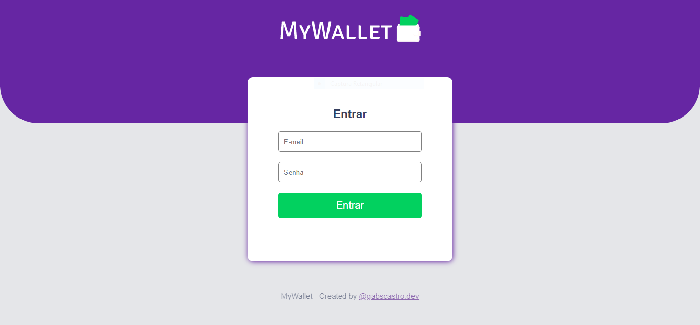
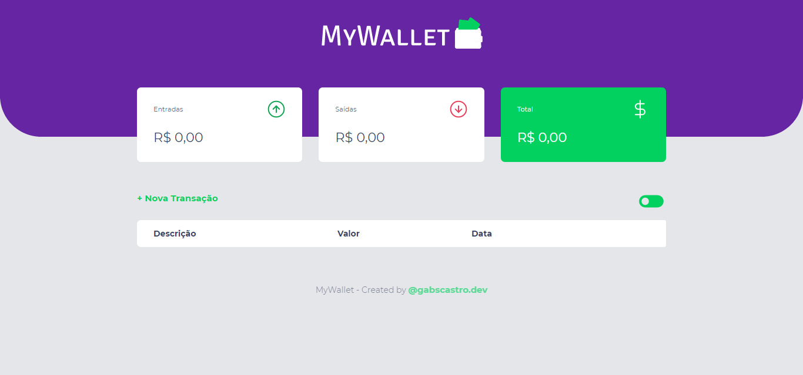
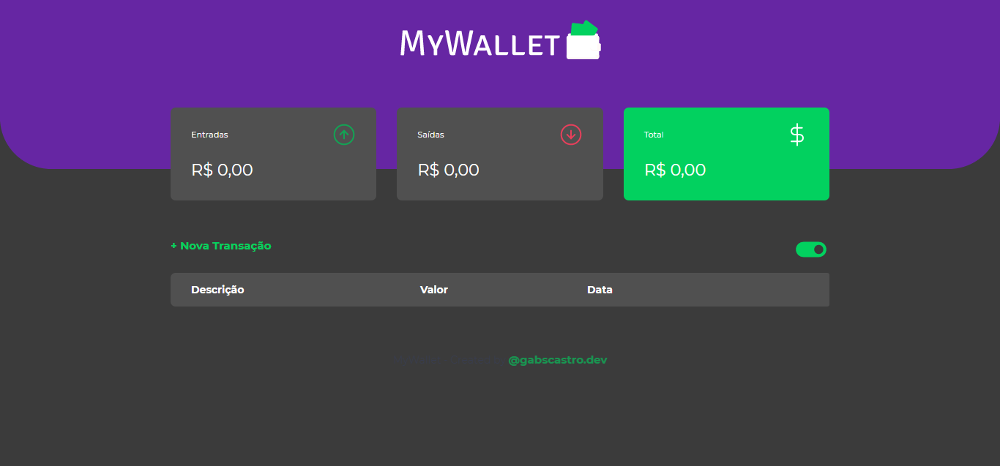

# MyWallet

MyWallet é um projeto de finanças pessoais desenvolvido durante a Maratona Discover da Rocketseat.

Claro ue fiz algumas modificações e ainda estou fazendo, algumas das modificaçoes que fiz:

- Criar página de login
- Adicionar modo dark
- Criar um servidor com NodeJS

<p align="center">
  
  
  
</p>

----------------------------------------------------------------------------------------------------

## Instalação

Para realizar a instalação do projeto basta realizar o download do projeto ou clonar o repositório. 
Feito isso, deve rodar o seguinte comando para instalar as dependências do projeto.

``` npm install ```

## Execução

Feito a instalação das dependências podemos executar um dos dois comandos abaixo para executar o servidor e assim acessarmos nossa aplicação.

``` npm start ```

ou

``` node app.js ```

Assim que executarmos, podemos acessar no browser o seguinte caminho "http://localhost:3000" e abrirá a aplicação.

Observe que pode dar alguns erros na hora de executar o servidor, mas alguns ocorrem devido ao código que inclui no projeto tentando acessar o mongodb.
Ainda estou desenvolvendo a conexao com o mongodb para fazer funcionar a autenticação de usuário, não se preocupe com isso, poderá testar a aplicação mesmo assim.

Fique a vontade para modificar o projeto também, e dar um commit aqui no projeto.
